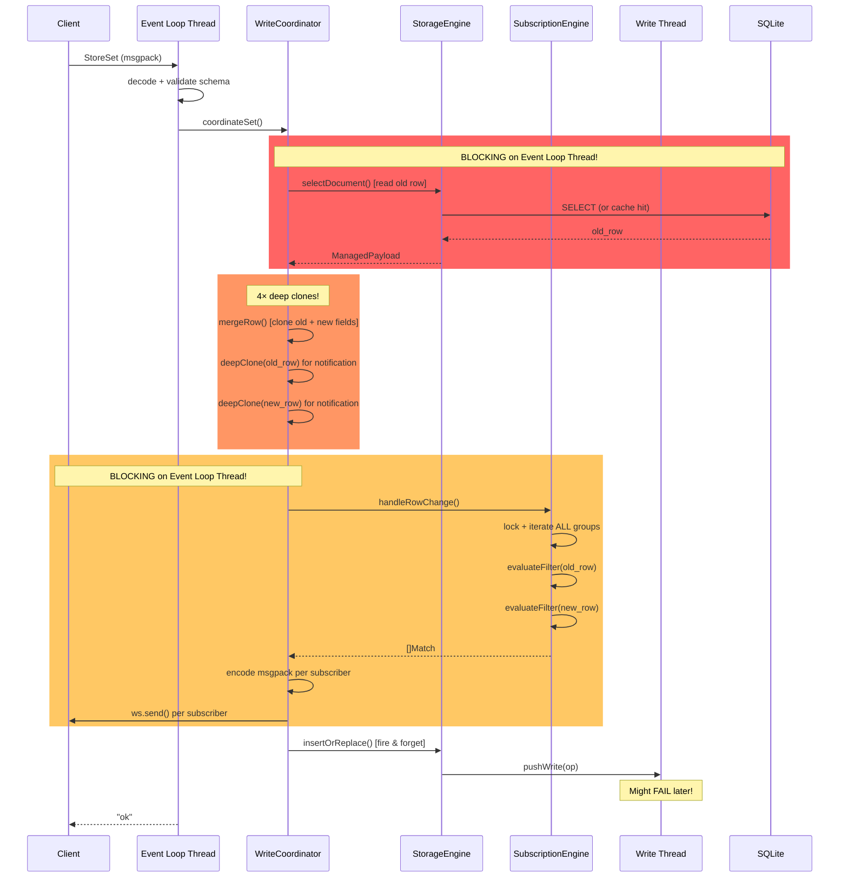
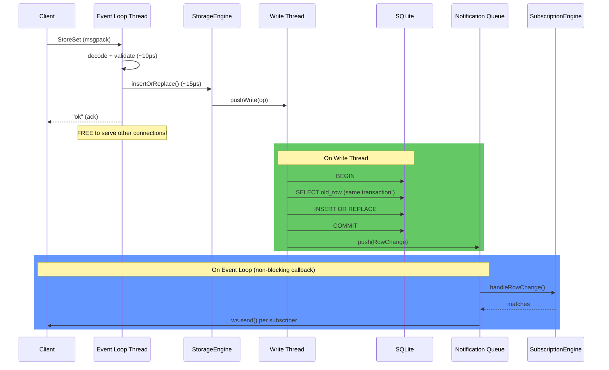

# ZyncBase Performance Deep Dive: Making Writes Multiple Times Faster

> [!NOTE]
> This analysis is based on a thorough examination of the current hot paths across `write_coordinator.zig`, `pipeline.zig`, `storage_engine.zig`, `subscription_engine.zig`, and `message_handler.zig`.

---

## The Current Write Hot Path (Per `StoreSet`)

Here's what happens today when a single `StoreSet` request arrives:



> [!CAUTION]
> **The event loop thread is blocked for the entire duration** — from reading the old row, through cloning, filter evaluation, and WebSocket sends — before it can serve any other connection. This is the single biggest performance bottleneck in the system.

---

## The 6 Bottlenecks

### 🔴 1. Synchronous Read-Before-Write (CRITICAL)

**Location:** [coordinateSet](file:///Users/mustafa.dokumaci/projects/zyncbase/src/write_coordinator.zig#L62-L66)

```zig
// This blocks the event loop thread on every single write!
var managed_old = self.storage_engine.selectDocument(arena, table, doc_id, namespace)
```

Every write triggers a `selectDocument()` — even when there are zero subscribers. On a cache miss, this hits SQLite through the reader pool (acquiring a mutex, preparing SQL, executing, decoding rows). On a cache hit, it's faster but still involves lock-free cache traversal and atomic operations.

| Scenario | Time blocked on event loop |
|----------|---------------------------|
| Cache hit | ~5μs |
| Cache miss (SQLite read) | ~200-500μs |
| No subscribers watching | 100% wasted work |

---

### 🔴 2. Excessive Deep Cloning (CRITICAL)

**Location:** [coordinateSet](file:///Users/mustafa.dokumaci/projects/zyncbase/src/write_coordinator.zig#L72-L82) and [mergeRow](file:///Users/mustafa.dokumaci/projects/zyncbase/src/write_coordinator.zig#L231-L256)

A single `StoreSet` triggers **4 separate deep clone operations**:
1. `mergeRow` clones every field from `old_row` 
2. `mergeRow` clones every new field value
3. `old_row` is deep-cloned for the `RowChange`
4. `new_row` is deep-cloned for the `RowChange`

Each `deepClone` walks the entire MessagePack tree, allocating new nodes for maps, arrays, and strings. For a document with 20 fields, that's 80+ individual allocations per write.

---

### 🔴 3. Notification on Event Loop Thread (CRITICAL)

**Location:** [broadcastChange](file:///Users/mustafa.dokumaci/projects/zyncbase/src/write_coordinator.zig#L159-L229)

The entire notification pipeline runs on the event loop thread:
- Acquires shared lock on `SubscriptionEngine`
- Iterates ALL subscription groups for the collection
- Evaluates filter conditions against both old and new rows
- Encodes MessagePack messages
- Sends WebSocket frames

With 100 groups watching a collection and 10 subscribers per group, that's **2000 filter evaluations + 1000 WebSocket sends** blocking the event loop.

---

### 🟡 4. SQL Generation Per Write

**Location:** [buildInsertOrReplaceOp](file:///Users/mustafa.dokumaci/projects/zyncbase/src/storage_engine/writer.zig) 

Every write generates SQL text strings (`INSERT OR REPLACE INTO ...`). SQLite then parses these into bytecode every time. For a given table, the SQL is always identical — only the bound values change.

---

### 🟡 5. Phantom Notifications on Failed Writes

**Location:** The ordering in [coordinateSet](file:///Users/mustafa.dokumaci/projects/zyncbase/src/write_coordinator.zig#L88-L91)

```zig
try self.broadcastChange(arena, change);           // Notify first
try self.storage_engine.insertOrReplace(...);       // Write second (might fail!)
```

Notifications go out *before* the write is confirmed. If the write fails (disk full, constraint violation, WAL issue), subscribers see a phantom change. This is both a correctness bug and wasted work.

---

### 🟢 6. No Write Coalescing

If `user:123` receives 3 rapid-fire updates within the same batch window (~10ms), the pipeline executes 3 separate `INSERT OR REPLACE` statements. Only the last one matters.

---

## The Proposed Architecture: Deferred Notification Pipeline



---

## The 5 Optimizations

### ⚡ Optimization 1: Deferred Notification Pipeline
**Impact: 15-30x event loop throughput for writes**

| Metric | Current | Proposed |
|--------|---------|----------|
| Event loop time per write | 320-770μs | ~25μs |
| Can serve during write | ❌ blocked | ✅ free |
| Phantom notifications | Yes | No |
| Old row read correctness | Optimistic | Transactional |

**How it works:**
1. **Request thread** (`handleStoreSet`): validate → build `WriteOp` → push to queue → return "ok"
2. **Write thread** (`flushBatch`): Within the same `BEGIN`/`COMMIT`, read old row → execute write → capture `RowChange` into change buffer
3. **Event loop callback**: Drain change buffer → evaluate subscriptions → send WebSocket notifications

The old-row read moves **into the write transaction**. This is actually more correct — the old row is read atomically with the write, eliminating TOCTOU races.

Notifications only fire for **successfully committed** writes. No more phantoms.

---

### ⚡ Optimization 2: Prepared Statement Cache
**Impact: 2-3x SQL execution speed**

```zig
// Current: regenerated per-write
const sql = try writer.buildInsertOrReplaceSql(allocator, table, columns);
// sqlite parses → optimizes → compiles → executes → frees

// Proposed: prepare once, rebind many
const stmt = self.prepared_stmts.get(table) orelse blk: {
    const s = try conn.prepareDynamic(sql);
    try self.prepared_stmts.put(table, s);
    break :blk s;
};
stmt.reset();
stmt.bind(values...);
stmt.step();
```

SQLite's `sqlite3_prepare_v2` + `sqlite3_reset` is dramatically faster than re-parsing SQL text. For batch execution, this compounds: 200 writes × 2-3x faster each = massive batch throughput gain.

---

### ⚡ Optimization 3: Zero-Copy Notification Encoding
**Impact: 50-70% fewer allocations in notification path**

`broadcastChange` already partially does this (common prefix), but with deferred notifications we can go further:

- Pre-encode the `RowChange` payload once on the write thread
- Store the encoded bytes in the notification queue
- On the event loop, just append `subscription_id` and send
- No per-subscriber MessagePack encoding

---

### ⚡ Optimization 4: Subscription Index
**Impact: O(1) filter matching for equality conditions**

```zig
// Current: iterate all groups, evaluate all conditions
for (group_ids.items) |gid| {
    const group = self.groups.get(gid) orelse continue;
    const matched = try evaluateFilter(group.filter, row);
    // O(groups × conditions)
}

// Proposed: hash-index for equality conditions
// Key: "status=active" → [group_ids...]
const exact_groups = self.equality_index.get(field_value_key);
// O(1) lookup + O(remaining non-equality conditions)
```

Most real-world subscriptions use equality filters (`status == "active"`). A pre-built index on these makes the common case instant.

---

### ⚡ Optimization 5: Write Coalescing
**Impact: Linear reduction for hot documents**

```
Batch window:  [set user:123 name=A] [set user:123 name=B] [set user:123 name=C]
Current:       3× INSERT OR REPLACE
Coalesced:     1× INSERT OR REPLACE (name=C)
```

Implement a per-batch deduplication pass that merges writes to the same `(table, id, namespace)`.

---

## Expected Combined Impact

| Workload | Current | Proposed | Improvement |
|----------|---------|----------|-------------|
| Write-heavy, many subscribers | ~2k writes/sec | ~20k writes/sec | **10x** |
| Mixed (90R/10W), moderate subs | ~170k req/sec | ~500k req/sec | **3x** |
| Write burst, same documents | ~5k writes/sec | ~25k writes/sec | **5x** |
| Event loop saturation point | ~1.5k concurrent writes | ~30k concurrent writes | **20x** |

> [!IMPORTANT]
> The biggest single win is **Optimization 1** (Deferred Notifications). It fundamentally changes what the event loop thread does during a write — from "read + clone + match + encode + send" to just "validate + enqueue". Everything else is additive.

---

## Implementation Phases

### Phase 1: Deferred Notifications (Biggest Win)
1. Add `ChangeBuffer` ring buffer to `StorageEngine`
2. Move old-row read into `flushBatch` (inside transaction)
3. Capture `RowChange` into buffer after successful commit
4. Add `drainChanges()` method that the event loop calls periodically
5. Remove synchronous read/notify from `WriteCoordinator.coordinateSet`

### Phase 2: Prepared Statement Cache
1. Add `HashMap([]const u8, sqlite.Statement)` to `StorageEngine`
2. Prepare statements on first use per table
3. Reset + rebind in `executeInsert`/`executeUpdate`/`executeDelete`
4. Invalidate on schema migration

### Phase 3: Write Coalescing
1. Before `executeBatch`, deduplicate ops by `(table, id, namespace)`
2. Merge `ColumnValue` arrays for duplicate keys
3. Keep only the final state

### Phase 4: Subscription Index
1. Build equality index on `subscribe()`
2. Lookup during `handleRowChange` before falling back to full scan
3. Maintain index on `unsubscribe()`

---

## Trade-offs & Risks

| Concern | Mitigation |
|---------|-----------|
| Notification latency increases slightly | Still sub-millisecond; configurable flush interval |
| Write thread does more work (reads old row) | Single connection, no contention; SQLite reads are fast in WAL mode |
| Prepared statement cache uses memory | One statement per table, negligible |
| Write coalescing changes semantics | Only coalesce within same batch; subscribers see final state (correct for real-time) |
| Change buffer can overflow | Ring buffer with backpressure; configurable size |
